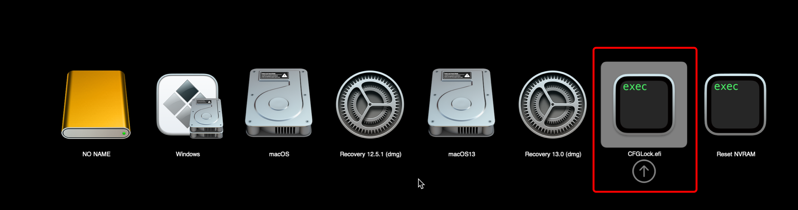
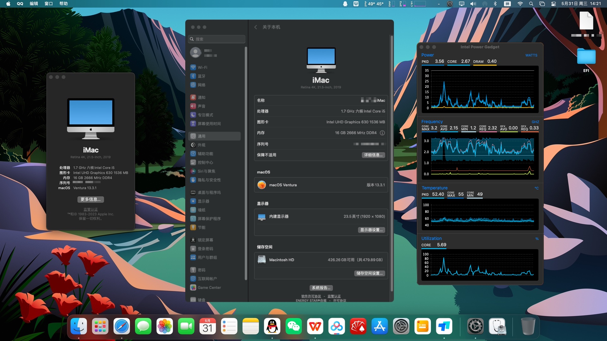

# 联想 IdeaCentre-AIO-逸-24ICB 黑苹果 OpenCore EFI


### [English](https://github.com/hackintosh-efi/Lenovo-IdeaCentre-AIO-YI-24ICB-OpenCore)

### OpenCore

[OpenCore 0.9.2](https://github.com/acidanthera/OpenCorePkg)

### MacOS已测试版本

- macOS Monterey 12.x
- macOS Ventura  13.x 

### 硬件

- 主板:联想 36FB (B360)
- Bios版本: 044CT20A（2021/12/23）
- 处理器: 英特尔 i5-8400T
- 内  存: 海力士 8G*2 DDR4 2666MHz
- 固  态: 1.东芝 KXG5AZNV256G Windows 10
- 固  态: 2.金泰克 SATA SSD 480G MacOS
- 核  显: 英特尔超核心显卡 630
- 声  卡: 瑞昱 ALC235
- 网  卡: 瑞昱 RTL8111
- 无  线: 博通94360NG (替换 瑞昱 RTL8821CE无线网卡 此网卡在黑苹果中无法驱动)
- 显示器: 联想 LENF9OO LEN-A340C-B-A 23.8英寸


### BIOS

```
设备
  |-- ATA设备菜单
    |-- 配置SATA为: ACHI
  |-- 显示菜单
    |-- 选择有效显示: IGD
    |-- 预指派内存大小: 64MB
    |-- 全部显示内存: 最大

高级菜单
  |-- CPU菜单
    |-- Intel(R) HT技术: 打开
    |-- 多核心处理功能: 打开
    |-- Intel(R) Virtualization技术: 打开
    |-- VT-d: 关闭

电源
  |-- Automatic Power On
    |-- 网络唤醒: 关闭

安全菜单
  |-- 安全启动
    |-- 安全启动: 关闭

启动菜单
  |-- 极速启动: 关闭
  
```

### 注意事项
 - 使用 [OpenCore Configurator](https://mackie100projects.altervista.org/opencore-configurator/) 生成 SMBIOS
 
 - 安装前务必使用CFGLock.efi工具解锁 CFG LOCK
 



### 已知问题

-  原机自带网卡 Realtek RTL8821CE 的`无线`和`蓝牙`无法使用.

- `HDMI` 接口无法输入信号 .

 
### 系统截图



### 联系我们

QQ Group: 23304408


